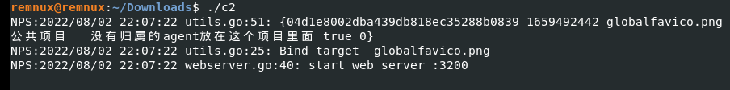
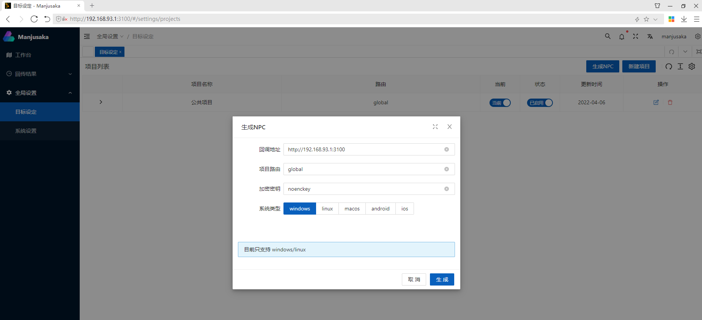
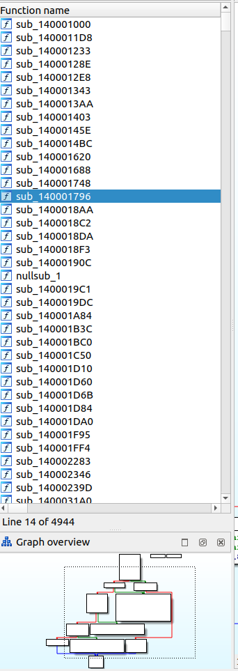

<!--more-->

# はじめに

こんにちは。DC2INTELの[morimolymoly](https://morimolymoly.com)です。\
Manjusakaなる中国発のC2フレー厶ワークをご存知でしょうか？

Talosのインテリジェンスチームによる[記事](https://blog.talosintelligence.com/2022/08/manjusaka-offensive-framework.html)は我々に衝撃を与えました。C2フレー厶ワークは最近乱立しているなかで中国発のものは目を引くものがあります。

今回は検体が入手できたのでかんたんに動作確認を行いました。

# 動作確認

検体は hxxps://github[.]com/YDHCUI/manjusaka から入手できます。

C2サーバを動かすと、ローカルサーバが立ち上がります。

ローカルサーバに接続するとコントロールパネルが表示されます。

英語表記にも対応しています。(ダークモードも)

当該レポジトリから画像を参照いたしますと、このパネルからRust製のインプラントを生成することが可能なようです。

# インプラント解析

今回はインプラントを入手できましたが、解析は行いませんでした。

Rust製でほとんどの関数がストリップされています。 別の記事で詳細な解析を行う予定です。

# おわりに

ただC2を動かすだけの虚無な記事になってしまいました。しかし、インプラントの解析の困難さ、C2のインターフェースの出来の良さには目を見張るものがあります。

今後DC2INTELはこれを脅威として観測していきたいと思います。

# IoCs

- 955e9bbcdf1cb230c5f079a08995f510a3b96224545e04c1b1f9889d57dd33c1
- 8e9ecd282655f0afbdb6bd562832ae6db108166022eb43ede31c9d7aacbcc0d8
