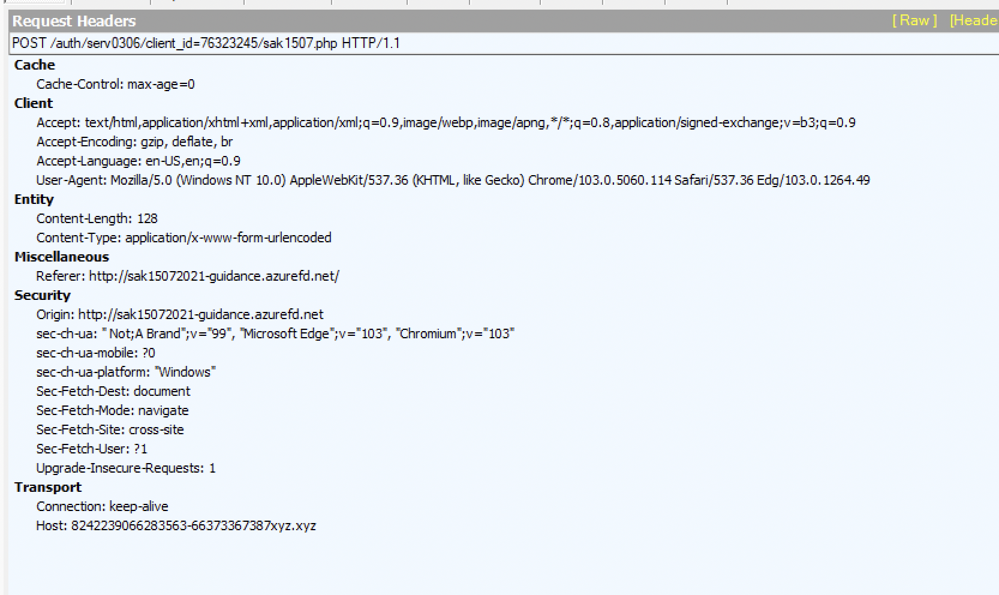
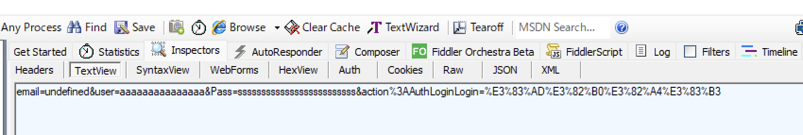

# はじめに
こんにちは。DC2INTELの[morimolymoly](https://morimolymoly.com)です。\
フィッシングサイトは星の数だけあります。\
自動生成されたものから、頑張ってアクターが構築するものまで様々です。\
難読化の動機としては、フィッシングサイトのAVによる検知回避や、そもそもIoCを解析者に取られたくないというものでしょう。\
今回は、MoqHaoの2022/04/15で観測されたフィッシングサイトとDC2INTELで観測し。解析したWebsiteとを事例に難読化の具合を解析していきます。

# MoqHao
最初に解析し報告されたのは[morimolymoly](https://morimolymoly.com)による[記事](https://morimolymoly.hateblo.jp/entry/2022/04/15/123757)です。



コードとしては単純で配列にある文字列の最後の要素をkeyとしてXORしてevalするだけです。

すると以下のようなコードが現れ、これを実行します。

```js
alert("APP Storeアカウントは安全異常があるので、再度ログインしてください。");
location.replace('hxxp://yrdlaebbqt.duckdns.org');
```

このようにしてIoCを簡単には取りづらくしていることがわかると思います。

# フィッシングサイト
最初に報告されたのは[Osumi, Yusuke氏](https://twitter.com/ozuma5119)によるツイートでした。


フィッシングサイトのスキャン結果は以下のとおりです。

https://urlscan.io/result/23969f8c-5a9b-4cc8-8046-5e99eb5fc973/

このさくらインターネットを装ったフィッシングサイトにも難読化が仕込まれていました。難読化としては以下のとおりです。\
https://gist.github.com/morimolymoly/e038d91cd69459b1f08fa8ddb77a9de5

非常に強い難読化がされており、おそらく[javascript-obfuscator](https://github.com/javascript-obfuscator/javascript-obfuscator)によるものだと考えられます。

これを動的解析すると、以下の結果が得られました。

<ul>
  {{- range .Page.Resources }}
    <li><a href="{{ .RelPermalink }}">{{ .Name }}</a>
  {{- end }}
</ul>




難読化処理で隠したかったのはロギングサーバのIoCとそれを送信するコードでしょう。

ロギングサーバは以下の通りです。

https://urlscan.io/result/5aa99525-1c94-4faf-be31-b36d6ff8de60/

shodanでスキャンすると、様々なポートが空いていることが確認できます。

https://www.shodan.io/host/104.168.243.119


# おわりに
フィッシングサイトはバックエンドたるIoCを隠すために難読化を仕込んでいます。
それは次第に巧妙になっており、MoqHaoの使用するものとさくらインターネットをターゲットにしたものでは大きく異なることがわかると思います。\
DC2INTELでは引き続きフィッシングサイトの難読化処理を観測&リサーチしていきたいと思います。
