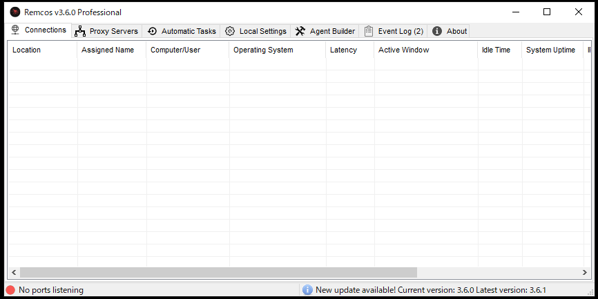

<!--more-->


# はじめに
こんにちは。DC2INTELの[morimolymoly](https://morimolymoly.com)です。\
今回はRemcosRATを購入した、とあるリサーチャーから情報提供いただきました。
この場を借りて感謝を申し上げます。

# RemcosRAT概要
RemcosRATはリモート管理ツールのとしてBreakingSecurity社から販売されているRATです。販売会社いわく、正規の目的で使用することが意図されているようですが、AntiAVである[Octopus Protector](https://breakingsecurity.net/octopus/)や、侵害後のC2インフラとしての[DNS Service](https://breakingsecurity.net/dns-service/)も販売しており、BreakingSecurity社の製品を購入するだけでbotnet構築をすべて賄うことができます。

そうした中で、RemcosRATはサイバー犯罪に使用されており、[APT](https://www.paloaltonetworks.jp/company/in-the-news/2018/unit42-gorgon-group-slithering-nation-state-cybercrime)や、バラマキ型メールによる[攻撃](https://www.cc.uec.ac.jp/blogs/news/2021/07/20210708agenttesla-remcosrat.html)、[銀行への攻撃](https://heimdalsecurity.com/blog/remcosrat-malware-is-targeting-african-banks/)など、正規のリモートアクセスツールではなく、脅威アクターが使用しているケースをみることがほとんどです。

クライムウェアをDC2INTELで調査する中、匿名を条件にRemcosRAT解析のために実際に購入したとある人物からDC2INTELに情報を提供いただきました。
その情報からRemcosRATの力を紐解いていきます。

# 購入方法
BreakingSecurity社に会員登録し、クレジットカード決済か暗号資産による決済で購入できます。
値段は€58.00で日本円で約8000円です。
情報提供者は暗号資産による決済で購入をしたようでした。

# RemcosRATのカスタマーサイト
カスタマーサイトでは購入履歴とダウンロード、サポートが提供されています。


# RemcosRATの使い方
まず、RemcosRATの鍵をkeygenにより生成します。


次に、builderを用いてRemcosRATをビルドしていきます。

最初にコネクションの設定を行います。今回は試験目的のためローカルネットを指定しています。
TLSで暗号化することができ、TLSは独自実装になっています。


次に、インストールを設定します。特権昇格などの機能を有しています。
自身を消すことも設定で可能です。


次に、RemcosRATの隠蔽設定を行います。プロセスインジェクションなどが設定できます。


キーロガーも設定可能です。普通のリモートアクセスツールに必要な機能でしょうか……？


スクリーンのロギングも可能です。


最後にビルド設定です。パッカーはMPRESSとUPXが使用可能です。


ビルド結果は以下の通りです。


管理パネルは以下のようになっています。



# RAT実行結果


RATに感染するとどのような操作も可能になります。
任意のコード実行から、カメラへのアクセス、キーロガー等、“リモートアクセスツール”の本領を発揮できます。

# アンダーグラウンド・マーケットでのRemcosRAT再販
アンダーグラウンド・マーケットではRemocosRATが再販されていることがあります。
独自のパッカーでパックし、AVやEDR evasionを行い、価値を提供します。


今回はPulseと呼ばれる再販品を入手し、解析を行いました。
まずはBinDiffの結果です。


関数の数からしてパックされていることが容易にわかります。
XPEViewerでも `.text` セクションがパックされていることがわかります。


実際にこの検体をアンパックしてみました。


これのConfigを抽出しました。

```json
{
  "Version": "3.6.0 Pro",
  "Host:Port:Password": "74.201.28.143:4782:1",
  "Assigned name": "srvhost",
  "Connect interval": "1",
  "Install flag": "Disable",
  "Setup HKCU\\Run": "Enable",
  "Setup HKLM\\Run": "Enable",
  "Install path": "AppData",
  "Copy file": "srvhost.exe",
  "Startup value": "srvhost",
  "Hide file": "Enable",
  "Mutex": "srvhost-8YECU3",
  "Keylog flag": "0",
  "Keylog path": "Application path",
  "Keylog file": "explorer.dat",
  "Keylog crypt": "Enable",
  "Hide keylog file": "Enable",
  "Screenshot flag": "Disable",
  "Screenshot time": "10",
  "Take Screenshot option": "Disable",
  "Take screenshot title": "",
  "Take screenshot time": "5",
  "Screenshot path": "AppData",
  "Screenshot file": "Screenshots",
  "Screenshot crypt": "Enable",
  "Mouse option": "Disable",
  "Delete file": "Disable",
  "Audio record time": "5",
  "Audio path": "Temp",
  "Audio folder": "TestSession",
  "Connect delay": "0",
  "Copy folder": "",
  "Keylog folder": "",
  "Keylog file max size": "100000"
}
```

脅威アクターもPro版を使用していることがわかりました。ちなみにこの検体は800人をRATしたと言われているため納得の結果となっております。

次に、MalwareBazaarで取れた検体とのBinDiff結果を載せます。


極めて同一のバイナリであると言えます。やはり脅威アクターはRemcosRATのPro版を正規購入もしくはクラックして使用しているようです。

# おわりに
RemcosRATを購入する、という目を引くタイトルでしたがいかがでしたでしたでしょうか？
実際に購入から使用方法までとあるリサーチャーから提供いただきましたが、これほどの強力なRATとクリプター、C2インフラを販売しているbreaking security社は脅威アクターに使用されていることを承知で行っていることは明らかです。
Ciscoによる[記事](https://gblogs.cisco.com/jp/2018/09/talos-picking-apart-remcos/)では同社へのOSINTにより犯罪者が正規の会社の皮を被って商売をしていることを明らかにしています。

くれぐれも興味本位で購入することは避けましょう。

また、再販事例など、RemcosRATへ独自パッカーなどの付加価値をつけて販売するケースも存在し、これもまた脅威といえます。

# IoCs
* d40fc7bd031e0ea6706bd1a196f7f404fb15df232fac914c7c0263edb12600ba
* 1c048a93fc173bacc2388da1042140aeb4d4b34c927e524d3b60946efdab1a16